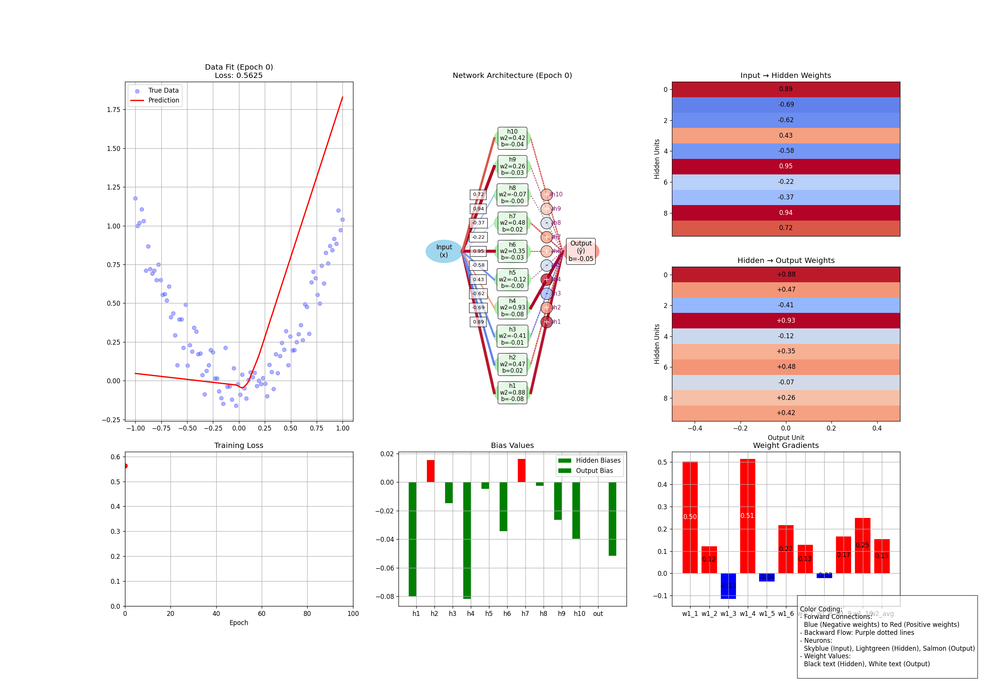

# Neural Network Visualization



This project provides an animated visualization of how a simple neural network learns through backpropagation. It demonstrates the training process of a neural network trying to approximate a quadratic function (y = x²).

## Features

- Visualizes the complete training process of a neural network
- Shows forward pass, backpropagation, and weight updates
- Includes 7 interactive panels displaying different aspects of the network
- Color-coded representations for easy understanding
- Animated learning progression

## Project Structure

neural-network-visualization/
- │
- ├── NN_vis.ipynb # Main colab notebook with visualization code
- ├── NN_vis.gif # Example output animation
- ├── README.md # This documentation file


## Installation

1. Clone the repository:
   ```bash
   git clone https://github.com/dishatimbadiya/neural-network-visualization.git
   cd neural-network-visualization
   ```

2. Run the notebook
   - Open this Notebook in Colab (https://colab.research.google.com/)

#### OR

   ```bash
   jupyter notebook Neural Network Visulization.ipynb
   ```
3. Execute all cells in the notebook to generate the visualization.

4. The animation will be saved as NN_vis.gif in the same directory.

## Network Architecture
- 1 input neuron
- 10 hidden neurons with ReLU activation
- 1 output neuron (linear activation)

## Visualization Panels
### Data Fit: Shows true vs predicted values
Loss Curve: Tracks error reduction over time
Network Diagram: Visual structure of the network
Input-Hidden Weights: Weight matrix visualization
Hidden-Output Weights: Weight matrix visualization
Bias Values: Shows bias terms for each neuron
Gradients: Displays weight update magnitudes

## Color Coding
### Weights: 
- Blue (negative)
- Red (positive)
### Backpropagation:
- Purple dotted lines
### Neurons:
- Input: Skyblue
- Hidden: Lightgreen
- Output: Salmon

## Customization
- You can modify these parameters in the code:
- Network architecture (number of hidden neurons)
- Learning rate
- Training epochs
- Display interval
- Data generation parameters

